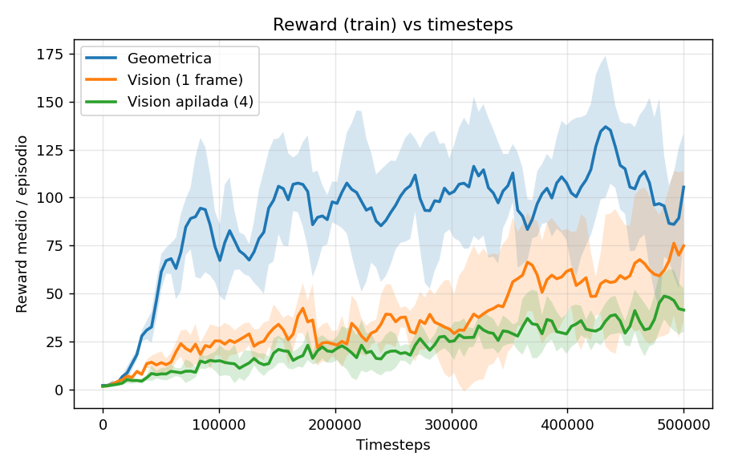

# Conducción autónoma estilo DeepRacer en Webots: el rol de la representación de la observación

> Informe técnico / paper en progreso.
> **Resultados de evaluación cargados** (§6) a partir de 15 corridas: 5 seeds × 3 variantes,
> 500k timesteps. Pendiente: curvas de TensorBoard (§6.1/6.3) y la variante LSTM.

---

## Resumen (abstract)

Entrenamos un agente de conducción autónoma sobre pistas estilo AWS DeepRacer
simuladas en Webots, usando **PPO** (Proximal Policy Optimization). El objetivo es
**aislar el efecto de la representación de la observación** sobre el desempeño,
manteniendo _todo lo demás constante_: mismo robot, mismo espacio de acción, mismas
pistas, mismos hiperparámetros y —crucialmente— **la misma función de reward**.

Comparamos tres variantes que solo difieren en _qué ve el agente_:

1. **Geométrica** — la observación es un vector de **métricas derivadas localmente de
   la imagen** (no los píxeles).
2. **Visión** — la observación es la **imagen cruda** de la cámara frontal (un frame).
3. **Visión apilada** — igual que Visión pero con **4 frames apilados** (información
   temporal).

El reward usa **información privilegiada del simulador** (progreso sobre el circuito,
detección de vuelta completa y de conduccion en sentido contrario) que el agente **no** recibe en su observación.
Esto convierte el experimento en un _ablation_ limpio sobre la representación de
entrada.

---

## 1. Introducción y objetivo

El problema es de **seguimiento de pista**: un robot debe recorrer un circuito cerrado
lo más rápido posible sin salirse a la zona de pasto. La pista sigue el modelo
DeepRacer: asfalto negro delimitado por **bordes blancos**, con una **línea amarilla
central decorativa** (pisable), rodeada de **pasto verde** (fuera de pista).

La pregunta de investigación es:

> **¿Cuánto importa la representación de la observación, a igualdad de todo lo demás?**
> ¿Conviene diseñar features a mano sobre la imagen, dárselos crudos a una CNN, o
> agregar memoria temporal apilando frames?

Para que la comparación sea atribuible _solo_ a la observación, fijamos un entorno y un
reward idénticos entre las tres variantes (Sección 3) y variamos únicamente el bloque de
observación + el extractor de features de la política (Sección 4).

---

## 2. Formulación del problema (MDP)

Modelamos la tarea como un **MDP de horizonte finito** resuelto con PPO.

- **Estado del simulador**: pose y velocidad del robot, imagen de la cámara frontal,
  textura/geometría de la pista activa.
- **Observación del agente** `oₜ`: depende de la variante (Sección 4). Es una _vista
  parcial_ del estado.
- **Acción** `aₜ`: comando continuo de las dos ruedas (Sección 4.4).
- **Reward** `rₜ`: función del progreso sobre el circuito y de la seguridad
  (Sección 3.3). **Idéntica entre variantes.**
- **Terminación**: salida de pista, contramano sostenido, carril perdido, o vuelta
  completada (éxito). **Truncado** por límite de pasos.

### 2.1 Robot y simulador

| Ítem                         | Valor                                                              |
| ---------------------------- | ------------------------------------------------------------------ |
| Simulador                    | Webots R2025a                                                      |
| Arena                        | `RectangleArena` 8×8 m, multi-pista por _swap_ de textura del piso |
| Robot                        | e-puck, tracción **diferencial** (2 ruedas)                        |
| Cámara                       | frontal, RGB **84×84**, montada mirando levemente hacia abajo      |
| Frame-skip (`ACTION_REPEAT`) | 5 ticks por acción                                                 |
| Pasos máx. por episodio      | 1000 (`MAX_EPISODE_STEPS`)                                         |
| Domain randomization         | jitter de pose sobre el spawn al inicio del episodio               |

> **Nota de generalización**: el entrenamiento usa varias pistas (`track1`–`track3`) y
> la evaluación pistas _held-out_ (`track4`–`track5`), nunca vistas en entrenamiento.

---

## 3. Entorno y reward compartidos (lo que NO cambia entre variantes)

Esta es la parte central del diseño experimental: **el contrato entre el agente y el
entorno es idéntico en las tres variantes**, salvo la observación.

### 3.1 Arquitectura cliente–servidor

- El **supervisor** de Webots corre la simulación, calcula el reward y arma la
  observación.
- El **trainer** (PPO, Stable-Baselines3) se conecta por socket: manda acciones,
  recibe `(observación, reward, terminated, truncated, info)`.

El supervisor es la **única fuente de verdad** del reward (`_compute_reward_breakdown`).

### 3.2 Información privilegiada (asymmetric information)

**El reward puede mirar información que el agente no observa.**
El supervisor conoce el estado completo del simulador y lo usa para construir un reward
_denso y bien orientado_, pero esa información **no entra en la observación**:

| Señal privilegiada                           | Cómo se obtiene                                                                     | ¿Entra en la obs?       |
| -------------------------------------------- | ----------------------------------------------------------------------------------- | ----------------------- |
| **Progreso sobre el circuito** (Δarc-length) | Proyección de la pose `(x,y)` sobre la poligonal de _gates_ del track (`project_s`) | **No**                  |
| **Vuelta completa**                          | Progreso acumulado ≥ perímetro (o cruce de la línea de meta del spawn)              | **No**                  |
| **Contramano**                               | Δarc-length negativo sostenido                                                      | **No**                  |
| **Pose/velocidad ground-truth**              | API del supervisor de Webots                                                        | Solo velocidad propia\* |

\* La velocidad propia `[forward, yaw_rate]` sí entra (es propioceptiva, un sensor real
del robot); la **geometría global del track no**.

Esto es **privileged reward shaping** / _asymmetric actor_: una técnica estándar donde
el reward usa información de oráculo en entrenamiento, pero la política aprende a actuar
solo con su observación parcial. Permite un reward con **sentido de dirección** (premia
avanzar _en el sentido correcto del circuito_, no solo ir rápido) sin filtrar esa
información a la entrada del agente.

### 3.3 Función de reward

Estructura (idéntica en las tres variantes):

```
si vuelta_completa:        r = +LAP_BONUS              (terminal, éxito)
si pasto_en_el_centro:     r = +OFFTRACK_PENALTY       (terminal, salida de pista)
en otro caso:
    r_avance  = REWARD_PROGRESS_W · Δs_norm · clearance     # progreso×centrado
    r_base    = REWARD_BASE · clearance
    r_offset  = -REWARD_OFFSET_W · |offset|                  # (peso 0 por defecto)
    r_white   = -REWARD_WHITE_W · white_center               # (peso 0 por defecto)
    r_lost    = LINE_LOST_PENALTY  si no se ve calzada
    r_step    = -REWARD_STEP_COST
    r = r_base + r_avance + r_offset + r_white + r_lost + r_step

terminación adicional:
    contramano sostenido (wrong_way_steps ≥ N) -> terminal con WRONG_WAY_PENALTY
    carril perdido (lost_line_steps ≥ N)       -> terminal
```

Donde:

- **`clearance`** = fracción de calzada en la banda central de la imagen (∈ [0,1]):
  _gate_ multiplicativo, solo se cobra fuerte yendo **centrado**.
- **`Δs_norm`** = progreso normalizado sobre el circuito (privilegiado). Reemplaza a la
  velocidad cruda como motor del avance → no premia _loopear_ ni ir en contramano.
- **`offset`, `white_center`, `green_center`** = features de color de la imagen
  (centroide de la calzada, blanco/verde en el centro).

| Parámetro                           | Valor       | Significado                                    |
| ----------------------------------- | ----------- | ---------------------------------------------- |
| `LAP_BONUS`                         | +5.0        | bonus terminal por vuelta                      |
| `OFFTRACK_PENALTY`                  | −1.0        | penalización terminal por salir a pasto        |
| `OFFTRACK_GREEN_FRAC`               | 0.4         | umbral de pasto-en-centro para declarar salida |
| `REWARD_PROGRESS_W`                 | 1.0         | peso del progreso                              |
| `WRONG_WAY_PENALTY`                 | −1.0 a −1.5 | penalización terminal por contramano           |
| `WRONG_WAY_MAX_STEPS`               | 12–30       | pasos de retroceso antes de cortar             |
| `REWARD_OFFSET_W`, `REWARD_WHITE_W` | 0.0         | penas laterales (desactivadas)                 |
| `REWARD_STEP_COST`                  | 0.0–0.03    | costo por step                                 |

> **Implicación experimental**: como el reward y la terminación son idénticos, cualquier
> diferencia de desempeño entre variantes es atribuible a **la observación y su
> extractor**, no a la señal de entrenamiento.

---

## 4. Variantes (lo que SÍ cambia)

Las tres variantes comparten robot, acción, pistas, reward e hiperparámetros de PPO.
**Difieren solo en el par (observación, extractor de features de la política).**

### 4.1 Tabla comparativa

|                       | **Geométrica**                                    | **Visión (1 frame)**                         | **Visión apilada (4 frames)**        |
| --------------------- | ------------------------------------------------- | -------------------------------------------- | ------------------------------------ |
| **Rama git**          | `geometrica`                                      | `master`, `--n-stack 1`                      | `master`, `--n-stack 4`              |
| **Observación**       | Vector `Box(9)` de métricas de imagen             | `Dict{image: 3×84×84, velocity: 2}`          | `Dict{image: 12×84×84, velocity: 8}` |
| **Origen de la obs**  | Métricas calculadas **localmente** sobre el frame | Píxeles crudos + velocidad                   | 4 frames + 4 velocidades apilados    |
| **Política SB3**      | `MlpPolicy`                                       | `MultiInputPolicy`                           | `MultiInputPolicy`                   |
| **Extractor**         | MLP                                               | CNN (NatureCNN) + MLP                        | CNN (NatureCNN) + MLP                |
| **Info temporal**     | Solo velocidad propia                             | Solo velocidad propia                        | **Sí** (4 frames)                    |
| **Normalización obs** | VecNormalize sobre todo el vector                 | VecNormalize solo en `velocity`; imagen /255 | ídem                                 |

### 4.2 Observación — Geométrica

Vector de **9 dimensiones** (`Box`, float32), todo derivado **localmente** de la imagen
de la cámara en ese timestep (track-agnóstico, no usa geometría global):

```
[ forward, yaw_rate,          # velocidad propia (propioceptiva, ∈ ~[-1,1])
  road_frac,                  # fracción de calzada visible en la ROI
  green_center,               # pasto en la banda central (proximidad a salirse)
  off_0, off_1, off_2, off_3, off_4 ]   # offset horizontal del centroide de calzada
                                        # en 5 franjas de CERCA -> LEJOS (curvatura)
```

Las features se calculan por clasificación de color (asfalto+amarillo = calzada;
blanco = borde; verde = pasto) sobre la franja inferior del frame. Los `off_i` trazan
_hacia dónde va la pista adelante_ (look-ahead en la imagen), sin waypoints ni geometría
del circuito.

### 4.3 Observación — Visión y Visión apilada

Diccionario con dos claves:

- **`image`**: cámara frontal, RGB, channel-first `uint8` `(3, 84, 84)`. SB3 la
  normaliza dividiendo por 255.
- **`velocity`**: velocidad propia del cuerpo `[forward, yaw_rate]`, normalizada.

En **Visión apilada** se aplica `VecFrameStack(n_stack=4)`: la imagen pasa a `(12,84,84)`
(4 frames en el eje de canales) y la velocidad a `(8,)` (historia temporal). Esto le da
al agente **percepción de movimiento** (no solo una foto estática).

### 4.4 Acción (idéntica en las tres)

Vector continuo de **2 dimensiones** `Box([-1,1]²)`: `[rueda_izq, rueda_der]`.

- El robot mapea cada componente de `[-1, 1]` a velocidad de rueda en
  `[WHEEL_MIN_SPEED, WHEEL_MAX_SPEED] = [1.5, 5.0]` rad/s.
- **Ambas siempre positivas**: el robot **no puede frenar ni ir en reversa**.

### 4.5 Modelo y entrenamiento (idéntico en las tres)

- **Algoritmo**: PPO (Stable-Baselines3).
- **Política**: `MlpPolicy` (geométrica) / `MultiInputPolicy` (visión). El extractor de
  visión es el `CombinedExtractor` de SB3 (NatureCNN sobre la imagen + MLP sobre la
  velocidad, concatenados).
- **VecNormalize**: normaliza la observación (en visión, solo `velocity`; la imagen va
  cruda /255). Opcionalmente normaliza el reward.
- **Hiperparámetros** (defaults del trainer):

| Hiperparámetro  | Valor |
| --------------- | ----- |
| `learning_rate` | 5e-4  |
| `n_steps`       | 1024  |
| `batch_size`    | 128   |
| `n_epochs`      | 5     |
| `gamma`         | 0.995 |
| `target_kl`     | 0.02  |
| `ent_coef`      | 0.02  |
| `vf_coef`       | 0.5   |
| `clip_range`    | 0.2   |
| `max_grad_norm` | 0.5   |

---

## 5. Protocolo experimental

> Esta sección define **cómo** se corren los experimentos; los números van en la
> Sección 6.

### 5.1 Comandos de entrenamiento

```bash
# Visión apilada (4 frames) — rama master
python -m rl.trainer --n-stack 4 --webots-world worlds/track1.wbt --seed <S>

# Visión (1 frame) — rama master
python -m rl.trainer --n-stack 1 --webots-world worlds/track1.wbt --seed <S>

# Geométrica — rama geometrica
git checkout geometrica
python -m rl.trainer --n-stack 1 --webots-world worlds/track1.wbt --seed <S>
```

### 5.2 Seeds y agregación

- **N seeds** por variante (sugerido N ≥ 5): `--seed 0..N-1`.
- Mismo `--total-timesteps` para las tres.
- Se reportan **media ± desvío** (o IQM) sobre las seeds.
- **Este informe**: 5 seeds (0–4), **500k timesteps**, `n_envs=4`. Agregación con
  `analysis/aggregate_eval.py`.

### 5.3 Evaluación

Sobre pistas _held-out_ (`track4`, `track5`), con el modelo final de cada seed:

```bash
python -m rl.evaluate --model <run_dir>      # todas las pistas de eval
```

La evaluación **guarda las métricas** en `<run_dir>/eval_results_<timestamp>.json`
(una entrada por track), para poder agregar entre seeds.

### 5.4 Métricas

**Convención**: cada métrica se mide en entrenamiento **[TRAIN]** (sobre las pistas
vistas, durante los rollouts) y/o en evaluación **[EVAL]** (sobre pistas held-out, con
el modelo final). Miden cosas distintas: TRAIN = _cuán rápido y bien aprende_; EVAL =
_cuán bien generaliza_.

**Dónde se guardan**:

- **[TRAIN]** → **TensorBoard** en `<run_dir>/tensorboard/` (namespace `custom/`),
  logueado por `RLMetricsCallback`.
- **[EVAL]** → **JSON** en `<run_dir>/eval_results_<timestamp>.json`, escrito por
  `rl/evaluate.py`.

| Métrica                       | Definición                                             | Fuente                                                           |
| ----------------------------- | ------------------------------------------------------ | ---------------------------------------------------------------- |
| **Tasa de vuelta** (lap rate) | % de episodios que completan una vuelta                | **[EVAL]** `lap_rate` · **[TRAIN]** `custom/lap_rate`            |
| **Tiempo a vuelta**           | pasos/segundos hasta completar la vuelta (solo éxitos) | **[EVAL]** `lap_steps_mean`, `lap_time_s_mean`                   |
| **Tasa off-track**            | % de episodios terminados por salir a pasto            | **[EVAL]** `failure_rates` · **[TRAIN]** `custom/offtrack_rate`  |
| **Tasa contramano**           | % terminados por contramano                            | **[EVAL]** `failure_rates` · **[TRAIN]** `custom/wrong_way_rate` |
| **Tasa carril perdido**       | % terminados por perder la pista                       | **[EVAL]** `failure_rates` · **[TRAIN]** `custom/line_lost_rate` |
| **Reward medio / episodio**   | retorno promedio                                       | **[EVAL]** `reward_ep_mean` · **[TRAIN]** `rollout/ep_rew_mean`  |
| **Eficiencia de muestras**    | timesteps hasta alcanzar X% de lap rate                | **[TRAIN]** (deriva de la curva `custom/lap_rate`)               |

> **Nota metodológica**: para una tasa de éxito **sin sesgo** se usa el modo de **N
> episodios fijos** (`--episodes`): corre N intentos pase lo que pase y reporta
> `lap_rate = vueltas/N`. Los resultados de §6 usan **10 episodios por track**.

---

## 6. Resultados

> **Datos**: 5 seeds × 3 variantes (15 corridas), **500k timesteps** c/u, `n_envs=4`.
> Evaluación sobre pistas **held-out** (`track4`, `track5`), **10 episodios/track** (modo
> tasa de éxito). Agregación: `analysis/aggregate_eval.py` → `analysis/results_summary.*`.

### 6.1 Curvas de aprendizaje — **[TRAIN]**

Extraídas de TensorBoard con `analysis/parse_tensorboard.py` (media ± desvío sobre las 5
seeds).



> **Importante**: el `lap_rate` de **train** NO es una métrica útil acá — una vuelta toma
> ~1080 steps y el episodio de training corta a 1000 (`MAX_EPISODE_STEPS`), así que **nunca
> entra una vuelta completa** y el lap_rate train queda truncado a ~0 para todas las
> variantes (geom 0.16 / visión 0.08 / apilada 0.0 de máximo). La curva de aprendizaje
> informativa es el **reward**.

Valores finales de train (media sobre seeds):

| Variante           | Reward final  | Off-track (train) |
| ------------------ | ------------- | ----------------- |
| Geométrica         | 105 (máx 137) | 0.61              |
| Visión (1 frame)   | 75            | 0.79              |
| Visión apilada (4) | 42            | 0.93              |

El orden es el **mismo** que en held-out: **geom > visión > apilada** también sobre las
pistas de entrenamiento.

### 6.2 Desempeño final (pistas held-out) — **[EVAL]**

Media ± desvío sobre las 5 seeds (pooled sobre los dos tracks held-out):

| Variante               | Lap rate (%)    | Reward/ep        | Off-track (%)   | Tiempo vuelta (s) |
| ---------------------- | --------------- | ---------------- | --------------- | ----------------- |
| **Geométrica**         | **60.0 ± 23.5** | **565.4 ± 107.5**| **28.0 ± 17.9** | **166.8 ± 18.6**  |
| Visión (1 frame)       | 4.0 ± 8.9       | 195.8 ± 67.0     | 96.0 ± 8.9      | 238.0 ± 0.0       |
| Visión apilada (4)     | 0.0 ± 0.0       | 42.8 ± 19.1      | 100.0 ± 0.0     | —                 |

Lap rate desglosado por pista (revela que la visión falla **incluso** en `track4`):

| Variante           | track4          | track5          |
| ------------------ | --------------- | --------------- |
| Geométrica         | 94.0 ± 13.4     | 26.0 ± 42.2     |
| Visión (1 frame)   | 0.0 ± 0.0       | 8.0 ± 17.9      |
| Visión apilada (4) | 0.0 ± 0.0       | 0.0 ± 0.0       |

Lap rate **por seed** (muestra la separación total): geométrica `[0.5, 0.6, 1.0, 0.5, 0.4]`,
visión `[0.0, 0.0, 0.0, 0.2, 0.0]`, visión apilada `[0, 0, 0, 0, 0]`.

### 6.3 Eficiencia de muestras — **[TRAIN]**

Timesteps hasta que el **reward medio** cruza cada umbral (el lap_rate de train no sirve
como métrica, ver §6.1):

| Variante           | reward ≥ 25 | reward ≥ 50 | reward ≥ 75 |
| ------------------ | ----------- | ----------- | ----------- |
| Geométrica         | 34k         | 50k         | 71k         |
| Visión (1 frame)   | 97k         | 353k        | 492k        |
| Visión apilada (4) | 273k        | nunca       | nunca       |

La geométrica es **~7× más eficiente** (reward 75 en 71k vs 492k de visión); la visión
apilada **nunca** alcanza reward 50 en 500k steps.

### 6.4 Tests de significancia — **[EVAL]**

Mann-Whitney **exacto** (permutación) sobre el lap rate por seed:

| Comparación                          | U    | p (two-sided) |
| ------------------------------------ | ---- | ------------- |
| Geométrica vs Visión (1 frame)       | 25.0 | **0.0079**    |
| Geométrica vs Visión apilada (4)     | 25.0 | **0.0079**    |
| Visión (1 frame) vs Visión apilada (4) | 15.0 | 1.0000        |

`U=25` es el **máximo** posible (n=5×5): **toda** seed geométrica supera a **toda** seed de
visión → separación total, y `p=0.0079` es el mínimo alcanzable con n=5+5. Las dos
variantes de visión son **estadísticamente indistinguibles** (p=1.0): ambas fallan.

---

## 7. Discusión

Los resultados son **fuertes y, en parte, contra-intuitivos**:

1. **Las features a mano (geométrica) dominan ampliamente.** 60% de lap rate en pistas
   nunca vistas, contra ≤4% de las variantes de visión, con **separación total** entre
   seeds (p=0.008). La razón es de **generalización**: las features geométricas son
   **invariantes a la apariencia** (offsets de la calzada relativos al agente), así que
   transfieren a pistas nuevas. La CNN, en cambio, aprende patrones de píxeles
   **específicos del training** y no transfiere — de hecho la visión falla **incluso en
   `track4`** (0%), lo que apunta a **overfitting de apariencia**, no a falta de capacidad.

2. **El frame stacking NO ayudó; si algo, empeoró.** Visión apilada (0%, reward 43) quedó
   por debajo de visión de 1 frame (4%, reward 196), aunque la diferencia entre ambas **no
   es significativa** (p=1.0): las dos esencialmente no generalizan. El stacking agrega 4×
   canales y más parámetros sin aportar la señal que falta: en esta tarea la dificultad es
   de **generalización de apariencia**, no de información temporal de corto plazo. Refuerza
   —desde otro ángulo— que la **memoria temporal no es el cuello de botella** acá.

3. **Incluso la geométrica sufre en `track5`** (26% vs 94% en `track4`): hay pistas
   intrínsecamente más difíciles (curvas cerradas / auto-aproximación) donde ninguna
   representación llega lejos. La alta varianza (±42 en track5) viene de eso.

**No es solo overfitting** (con las curvas de train, §6.1/6.3): la geométrica también es
mejor *sobre las pistas de training* — mayor reward final (105 vs 75 vs 42), menor off-track
(0.61 vs 0.79 vs 0.93) y **~7× más eficiente en muestras**. O sea, la visión es a la vez
**peor aprendiz** y **peor generalizador**: no es que aprenda bien el training y solo falle
al transferir. El colapso a 0–4% en held-out (con reward de train no nulo) indica que,
además, **lo poco que aprende no transfiere** (apariencia específica del training).

---

## 8. Limitaciones

- **La dirección de marcha no es perceptible desde una observación local.** Ni los
  features geométricos ni un solo frame codifican "para qué lado es adelante en el
  circuito". El reward lo resuelve con información **privilegiada** (progreso/contramano),
  pero la _política_ opera ciega a la dirección global: en pistas que se auto-aproximan,
  la cámara puede ver dos tramos y el agente saltar de carril. El apilado de frames
  mitiga parcialmente (da sentido de movimiento) pero no garantiza orientación global.
- **Escala de las pistas**: diseñadas a mano (Inkscape); curvas muy cerradas pueden
  exceder el radio de giro efectivo del robot diferencial.
- **Reward dependiente de color**: la detección de pista asume el esquema de color
  DeepRacer (blanco/amarillo/verde). Cambios de iluminación/textura podrían degradarla.

---

## 9. Trabajo relacionado / variantes paralelas (fuera del ablation)

- **Rama `ackerman`**: mismo problema con un robot de **dirección Ackermann** (auto
  1/18 estilo DeepRacer), acción `[steering, speed]`. Sirve para estudiar el efecto del
  **modelo cinemático** (el giro acotado del Ackermann limita el cambio brusco de
  rumbo). No forma parte del ablation de observación (cambia el robot y la acción).

---

## 10. Conclusión

A igualdad de reward, robot, acción e hiperparámetros, **la representación de la
observación es un factor de primer orden**, y en esta tarea el orden es nítido:

> **features geométricas invariantes a la apariencia ≫ píxeles crudos ≈ píxeles apilados.**

El diseño de features a mano (offsets de calzada relativos al agente) **generaliza** a
pistas nuevas donde la CNN sobre píxeles crudos **no transfiere** (overfitting de
apariencia), y el **apilado de frames no la rescata**. La hipótesis inicial —que features
y temporalidad "compensan" la dificultad de los píxeles— **se cumple para las features** y
**se rechaza para el stacking**: en esta tarea la temporalidad no es el cuello de botella;
la **invariancia a la apariencia** sí.

Esto motiva el trabajo futuro: mejorar la generalización de la visión con **data
augmentation** (DrQ/RAD) y arquitecturas tipo **IMPALA-CNN**, antes que con más memoria
temporal.

---

## Apéndice A — Reproducibilidad

- Reward y terminación: `controllers/supervisor_controller/supervisor_controller.py`
  (`_compute_reward_breakdown`, `_handle_step_env_request`).
- Features geométricos: `helpers/geom_obs.py`, `helpers/lane_vision.py`
  (`detect_lane`, `road_band_offsets`).
- Observación de visión: `rl/env.py`, `helpers/image_obs.py`.
- Progreso por gates: `helpers/track_progress.py` (`build_loop`, `project_s`,
  `signed_delta`).
- Trainer / hiperparámetros: `rl/trainer.py`.
- Evaluación: `rl/evaluate.py`.
- Pistas y spawns/gates: `worlds/`, `spawns.json`.
