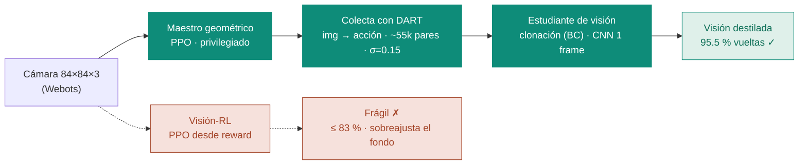
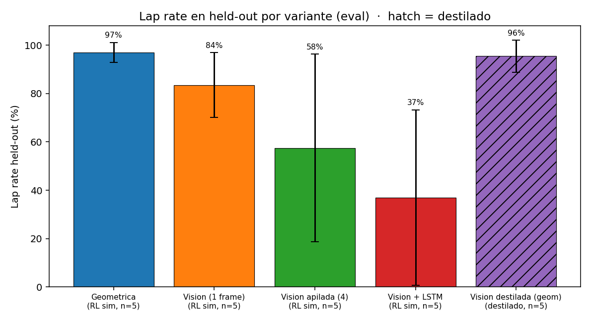
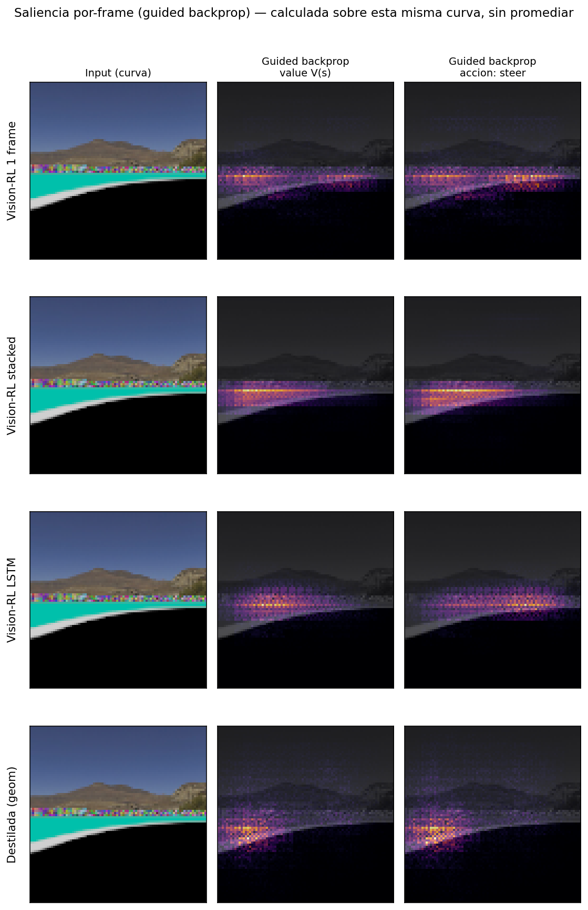
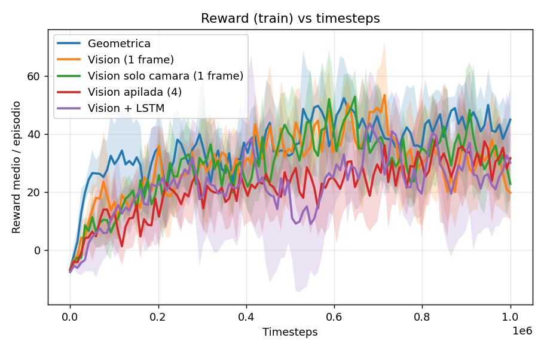
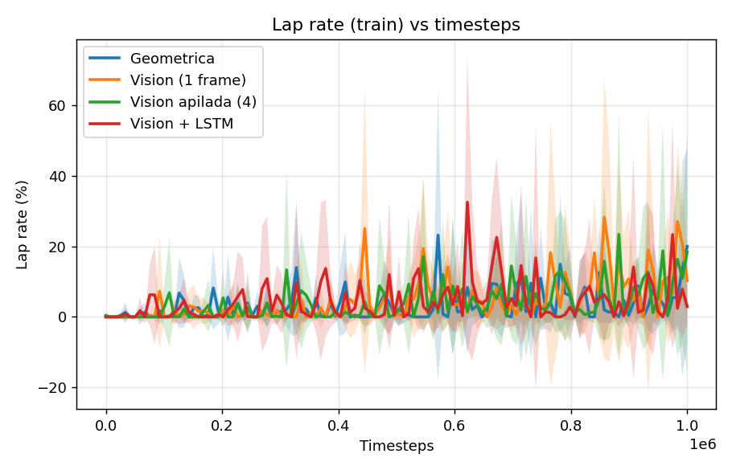

# De la percepción privilegiada a los píxeles

**Destilación de políticas para conducción autónoma** — qué representación de la observación aprende a
conducir en un agente de carreras estilo **AWS DeepRacer**, y por qué **destilar un maestro geométrico**
gana. Entrenado con **PPO (Stable-Baselines3)** dentro del simulador **Webots**.

> 📄 **Página interactiva (paper):** <https://fluchetti45.github.io/deepracer/>
> — versión navegable con las figuras a color, tablas y saliencia. Este README la espeja.

---

## Resumen

Comparamos **cinco representaciones de la observación** para un agente de conducción autónoma, entrenadas
con PPO en Webots sobre el **mismo entorno, recompensa, presupuesto (1M timesteps) y configuración** —
*lo único que cambia es la observación*:

- un **agente geométrico privilegiado** (features de calzada extraídas de la cámara),
- tres **agentes de visión pura** entrenados con RL (un frame, cuatro frames apilados, y uno recurrente con LSTM),
- un **agente de visión destilado** del geométrico por clonación de comportamiento.

Sobre pistas *held-out* y con **randomización del fondo**, el agente destilado **iguala al maestro
privilegiado** —95.5 % vs 97.0 % de vueltas completadas, sin diferencia estadística (p = 1.000)— y lo
**supera en tiempo de vuelta**, mientras que entrenar la visión directamente con RL es **inestable**, y
agregar estructura temporal (stacking, recurrencia) **la empeora**. Mapas de saliencia muestran que la
destilación **desplaza la atención de la CNN del fondo hacia la calzada**, lo que explica su invarianza al
entorno.

---

## El pipeline de destilación

Una misma cámara alimenta dos caminos. El **baseline** entrena la visión con RL directo desde la
recompensa. **Nuestro método** primero entrena un maestro geométrico privilegiado, colecta sus decisiones
con ruido DART (para cubrir estados de recuperación) y entrena por clonación un estudiante de visión que
hereda *qué mirar*.



### Las cinco representaciones

| Variante | Régimen | Observación |
|---|---|---|
| **Geométrica** | privilegiado (RL) | ~9 features de calzada (road-fraction, offset lateral, heading) + velocidad. Techo de referencia. |
| **Visión (1 frame)** | visión-RL | CNN sobre un cuadro RGB crudo. La visión pura mínima. |
| **Visión apilada (4)** | visión-RL | Cuatro frames apilados para dar información temporal. |
| **Visión + LSTM** | visión-RL | Política recurrente: la memoria la aporta el LSTM en vez del stacking. |
| **Visión destilada** | destilado (BC) | CNN de 1 frame entrenada por clonación para imitar al maestro geométrico. |

---

## Resultados

Evaluación sobre **dos pistas held-out** (`track9`, `track10`) con **fondo aleatorio** y semilla de
evaluación fija (todos los modelos ven exactamente los mismos episodios). Métrica: fracción de vueltas
completadas. **5 seeds por variante** (25 modelos en total).

| Variante | Régimen | Lap rate (%) | Off-track (%) | Tiempo vuelta (s) | Reward/ep |
|---|---|--:|--:|--:|--:|
| **Geométrica** | privilegiado (RL) | **97.0 ± 4.1** | 3.0 ± 4.1 | 181 ± 22 | 534 ± 18 |
| **Visión destilada** | destilado (BC) | **95.5 ± 6.7** | 3.5 ± 4.9 | **161 ± 25** | 482 ± 37 |
| Visión (1 frame) | visión-RL | 83.5 ± 13.4 | 7.0 ± 5.7 | 197 ± 31 | 406 ± 27 |
| Visión apilada (4) | visión-RL | 57.5 ± 38.8 | 33.0 ± 33.0 | — | 382 ± 65 |
| Visión + LSTM | visión-RL | 37.0 ± 36.3 | 51.5 ± 26.2 | — | 284 ± 44 |

> **La visión destilada es estadísticamente indistinguible del maestro privilegiado** (Mann-Whitney sobre
> 5 seeds, p = 1.000) — y es **el conductor confiable más rápido**. Recupera la competencia del agente
> privilegiado desde los píxeles.



### La visión-RL es una lotería; la destilación, no

El promedio esconde lo esencial: las variantes temporales son **bimodales** — algunas seeds convergen,
otras colapsan. La destilación (y el maestro) rinden parejo en las 5.

| Variante | seed 0 | seed 1 | seed 2 | seed 3 | seed 4 |
|---|--:|--:|--:|--:|--:|
| Geométrica | 100 | 98 | 98 | 90 | 100 |
| Visión destilada | 100 | 92 | 100 | 100 | 85 |
| Visión (1 frame) | 90 | 92 | 60 | 90 | 85 |
| Visión apilada (4) | 38 | 90 | 5 | 55 | 100 |
| Visión + LSTM | 5 | 65 | 0 | 32 | 82 |

| Comparación | p (Mann-Whitney) | Veredicto |
|---|--:|---|
| Geométrica vs Visión destilada | **1.000** | sin diferencia |
| Geométrica vs Visión (1 frame) | 0.032 | * |
| Geométrica vs Visión + LSTM | 0.008 | ** |
| Visión destilada vs Visión + LSTM | 0.008 | ** |
| Visión destilada vs Visión (1 frame) | 0.079 | marginal |
| Visión (1 frame) vs Visión + LSTM | 0.032 | * |
| Visión destilada vs Visión apilada (4) | 0.103 | n.s. |
| Geométrica vs Visión apilada (4) | 0.127 | n.s. |

<sub>Test exacto de Mann-Whitney, dos colas, sobre lap-rate por seed (n=5). * p&lt;0.05 &nbsp; ** p&lt;0.01 &nbsp; n.s. = no significativo.</sub>

---

## Por qué funciona: la CNN deja de mirar el fondo

Guided backprop (qué píxeles mueven la decisión) calculado **sobre este mismo frame** —una curva— para el
**valor del crítico** V(s) y para el **steering**, en las cuatro variantes de visión (todas seed 0). La
saliencia corresponde exactamente a la imagen mostrada (no es un promedio).



**Las tres variantes RL puras** (1 frame, stacked, LSTM) encienden la saliencia en una **franja sobre el
horizonte** —el muro y las montañas del fondo—: usan el entorno, constante en entrenamiento, como atajo.
**La destilada** desplaza la atención hacia **abajo, sobre la calzada y el borde curvo del carril**, con el
horizonte apagado: hereda del maestro geométrico *qué mirar*. Por eso se sostiene bajo randomización del
fondo. Dentro de cada modelo, **value** y **steer** coinciden (comparten el extractor CNN).

### Curvas de aprendizaje

Las cuatro variantes RL (5 seeds, banda = ± desvío). La visión-RL aprende más lento y con bandas anchas;
el geométrico converge parejo. La destilada es supervisada (no aparece en estas curvas de RL).

| Reward por episodio | Lap rate held-out durante el entrenamiento |
|---|---|
|  |  |

---

## Setup experimental

Las cinco variantes comparten todo salvo la observación. Hiperparámetros reales de los runs finales
(`models/<id>/run_metadata.json`):

**PPO (las cuatro variantes RL)**

| | |
|---|---|
| Algoritmo | PPO (Stable-Baselines3) |
| Política | MultiInput Actor-Critic — NatureCNN (imagen) + MLP (velocidad) |
| Timesteps | 1 000 000 |
| Entornos paralelos | 4 |
| n_steps / rollout | 256 (1 024 transiciones/actualización) |
| Batch size · Épocas | 128 · 5 |
| Learning rate | 5 × 10⁻⁴ |
| γ · Clip · Ent · VF | 0.995 · 0.2 · 0.02 · 0.5 |
| Normalización | VecNormalize (reward) |
| Seeds | 0, 1, 2, 3, 4 |

**Destilación (BC)**

| | |
|---|---|
| Objetivo | Clonación de comportamiento (MSE sobre la acción) |
| Maestro | Geométrico privilegiado, misma seed que el estudiante |
| Colecta | Apareada: limpia (σ=0) + DART (σ=0.15) |
| Pares (estado, acción) | ≈ 55 000 por seed |
| Épocas · LR | 30 · 3 × 10⁻⁴ |
| Backbone | NatureCNN, 1 frame (idéntico a Visión-RL 1 frame) |

**Entorno & evaluación**

| | |
|---|---|
| Simulador | Webots R2025a · Stable-Baselines3 / sb3-contrib |
| Observación (visión) | Imagen RGB 84 × 84 × 3 (× n_stack) |
| Observación (geométrica) | ≈ 9 features de calzada + velocidad |
| Acción | Box continuo (steer, throttle) |
| Reward | Progreso sobre la pista − penalizaciones (compartido) |
| Randomización de dominio | Textura de pared + skybox rotadas por episodio |
| Evaluación | 2 pistas held-out · 20 ep/pista · fondo aleatorio · `--eval-seed 0` |

---

## Reproducir

```powershell
# 1. Instalar
python -m venv env; .\env\Scripts\Activate.ps1
pip install -r requirements.txt
# El .env viene versionado en cada rama (la config de cámara/robot cambia por variante).

# 2. Entrenar una variante suelta (el trainer lanza Webots)
python -m rl.trainer --total-timesteps 1000000 --n-stack 1 --n-envs 4 --n-steps 256 --norm-reward

# 3. Entrenar TODAS las variantes/seeds y evaluarlas (switch de rama automático)
python run_full_pipeline.py            # train (5 variantes × seeds) + eval de esas mismas seeds

# 4. Destilación apareada geométrico → visión  (checkout vision_distill primero)
git checkout vision_distill
python run_all_distill.py --seeds 0 1 2 3 4        # colecta (limpio+DART) + BC por seed

# 5. Evaluar los 25 modelos con fondo aleatorio y misma secuencia de episodios
python run_all_evals.py --discover --episodes 20 --randomize-background --eval-seed 0
```

> Las variantes viven en **ramas distintas** porque el observation-space cambia: `master` (visión 1 frame
> y stacked), `geometrica`, `vision_lstm`, `vision_distill`. **El pipeline de destilación** (`rl/distill.py`,
> `rl/collect_teacher.py`, `run_all_distill.py`) vive en la rama **`vision_distill`**. Los scripts
> `run_all_*` / `run_full_pipeline` hacen el `git checkout` por vos; corré siempre con el working tree limpio.

Cada corrida genera `models/<timestamp>/` con `final_model.zip`, `vecnormalize.pkl`, `tensorboard/` y
`run_metadata.json`. El análisis de las evals y las figuras se generan desde `analysis/`.

---

## Conclusiones

- Un agente **privilegiado** con percepción limpia de la calzada resuelve la tarea (97 %).
- **Destilarlo a visión pura** recupera ese desempeño sin pérdida significativa (95.5 %, p = 1.0) y con
  mejor tiempo de vuelta — el estudiante de píxeles le gana la vuelta al maestro.
- Entrenar la **misma visión con RL directo** es poco confiable, y **la temporalidad la empeora**: stacking
  y recurrencia desestabilizan la optimización (KL disparado, crítico colapsado) en vez de ayudar.
- **Lectura:** el límite de la visión-RL no es la *capacidad* de la representación, sino la *asignación de
  crédito* a través de píxeles en un problema parcialmente observable. La destilación lo esquiva con targets
  supervisados densos del agente privilegiado.

## Limitaciones

- **Solo simulación** — no evaluamos transferencia a hardware real; el maestro usa features extraídas en el
  simulador, que en el mundo real habría que estimar con percepción.
- **Familia de pistas acotada** — dos pistas held-out de la misma distribución de arena.
- **Randomización de dominio parcial** — varía pared y skybox, no geometría, iluminación ni cámara.
- **El estudiante hereda el techo del maestro** — el BC no puede superar la política del geométrico (la
  mejora en tiempo viene de acciones más suaves).
- **Sensibilidad a la semilla** — la bimodalidad de la visión-RL sugiere alta sensibilidad a seed/HP.

## Related work

- **Chen et al., 2019** — *Learning by Cheating* (CoRL). Destilar un agente privilegiado a uno de visión: la base directa.
- **Ross et al., 2011** — *DAgger* (AISTATS). Corrimiento de covariables del BC ingenuo.
- **Laskey et al., 2017** — *DART* (CoRL). Ruido en la acción del maestro para cubrir estados de recuperación (σ=0.15).
- **Tobin et al., 2017** — *Domain Randomization* (IROS). Randomizar lo irrelevante fuerza invarianza.
- **Schulman et al., 2017** — *PPO* (arXiv). El algoritmo de RL on-policy usado.
- **Mnih et al., 2015** — *NatureCNN* (Nature). El extractor convolucional de la política de visión.
- **Balaji et al., 2020** — *DeepRacer* (ICRA). La plataforma que motiva el escenario.

---

## Arquitectura del sistema

Tres procesos que se comunican por socket:

- **`controllers/agent_controller/`** — corre en el robot (cámara + ruedas). Aplica acciones y devuelve la observación sensorial.
- **`controllers/supervisor_controller/`** — servidor del environment: atiende `reset_env` / `step_env`, avanza la simulación, calcula el reward (visión-pura) y aplica la randomización de dominio del fondo.
- **`rl/`** — el lado de entrenamiento. `NavEnv` (Gymnasium) habla con el supervisor por TCP; `trainer.py` arma PPO con `VecNormalize` + `VecFrameStack`. `distill.py` hace la clonación; `evaluate.py` corre las evals.

```
deepracer/
├── controllers/
│   ├── agent_controller/        # robot (camara + ruedas)
│   └── supervisor_controller/   # servidor del environment + reward + domain randomization
├── helpers/                     # lane_vision, image_obs, puentes de socket, policy_runner
├── rl/
│   ├── env.py                   # NavEnv (Gymnasium) sobre socket
│   ├── trainer.py               # entrenamiento PPO
│   ├── evaluate.py              # evaluacion (--randomize-background, --eval-seed)
│   ├── distill.py               # clonacion de comportamiento (BC)   [rama vision_distill]
│   └── collect_teacher.py       # colecta del maestro (limpio + DART)  [rama vision_distill]
├── analysis/                    # agregado de evals, saliencia, figuras
├── run_full_pipeline.py         # train + eval de todas las variantes/seeds
├── run_all_experiments.py       # solo train (switch de rama automatico)
├── run_all_evals.py             # solo eval  (--discover)
├── run_all_distill.py           # destilacion apareada multi-seed      [rama vision_distill]
├── docs/img/                    # figuras del README
├── worlds/                      # mundos y texturas de Webots
├── requirements.txt
└── .env.example
```

---

## Cómo citar

```bibtex
@mastersthesis{luchetti2026privilegiada,
  title   = {De la percepci{\'o}n privilegiada a los p{\'i}xeles:
             destilaci{\'o}n de pol{\'i}ticas para conducci{\'o}n aut{\'o}noma},
  author  = {Luchetti, Faustino},
  year    = {2026},
  note    = {Proyecto de tesis. Webots R2025a, Stable-Baselines3 (PPO)},
  url     = {https://github.com/fluchetti45/deepracer}
}
```

---

## Requisitos

- **[Webots](https://cyberbotics.com/) R2025a** (o compatible) · **Python 3.10+**
- Dependencias de [`requirements.txt`](requirements.txt): `stable-baselines3[extra]`, `sb3-contrib`, `gymnasium`, `python-dotenv`, `numpy`.
- El `.env` (versionado por rama) define la resolución de cámara (`CAMERA_WIDTH/HEIGHT`), que **debe coincidir** con el nodo `Camera` del robot en el mundo de Webots, además de los pesos del reward y la config de domain randomization.
